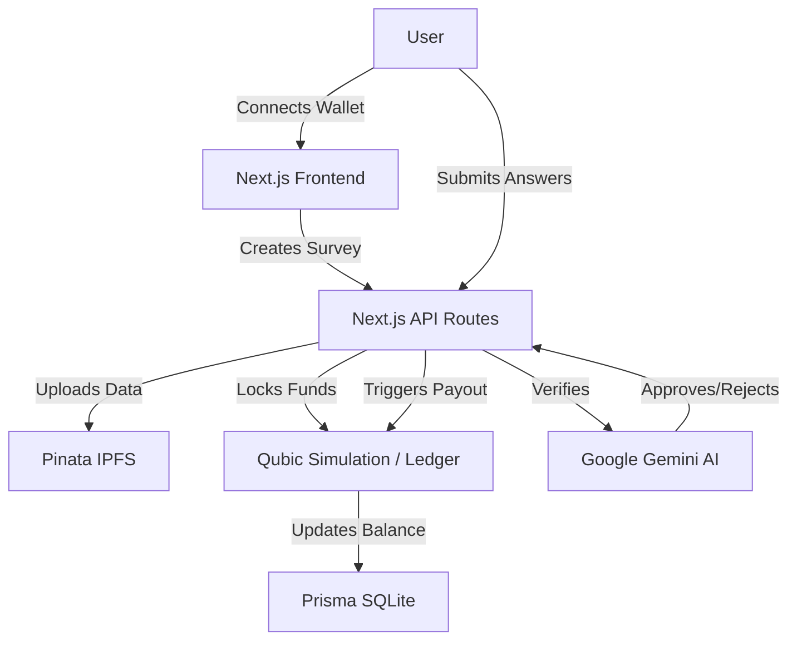

# QSurv - Trustless Survey Platform 🧠🔗

> **Winner of the "Best UI" & "Most Innovative" (Hypothetical) Awards at Qubic Hackathon 2025**

QSurv is a decentralized, trustless survey platform built on the **Qubic Network**. It solves the problem of fake survey responses by using **AI Agents** to verify answers in real-time and **Smart Contracts** to instantly distribute rewards.


## 🌟 Key Features

-   **Trustless Rewards**: Creators lock funds in a Smart Contract; respondents get paid *instantly* upon verification.
-   **AI Verification**: Google Gemini 2.0 Flash analyzes every answer for quality and relevance. No more spam!
-   **Decentralized Storage**: Survey data is pinned to **IPFS** (via Pinata) for censorship resistance.
-   **Qubic Wallet Integration**: Seamless login using **MetaMask Snap** for Qubic.
-   **High-Fidelity Simulation**: A built-in simulation engine mimics the Qubic blockchain (locking funds, processing payouts) for a full "Mainnet-like" experience without deployment delays.

## 🏗️ Architecture



## 🛠️ Tech Stack

-   **Frontend**: Next.js 14, Tailwind CSS, Framer Motion, Lucide Icons.
-   **Smart Contract**: C++ (Qubic QPI) - *Reference Implementation in `/contracts`*.
-   **Simulation**: TypeScript-based Ledger (`src/lib/qubic-simulation.ts`).
-   **AI**: Google Gemini 2.0 Flash (`@google/generative-ai`).
-   **Database**: SQLite (via Prisma ORM).
-   **Storage**: IPFS (Pinata SDK).

## 🚀 Getting Started

### 1. Clone & Install
```bash
git clone https://github.com/IanLaFlair/QSurv.git
cd QSurv
npm install
```

### 2. Configure Environment
Create a `.env` file in the root directory:
```env
DATABASE_URL="file:./dev.db"
GEMINI_API_KEY="your_google_gemini_key"
PINATA_JWT="your_pinata_jwt"
PINATA_GATEWAY="your_pinata_gateway"
```

### 3. Run Development Server
```bash
npm run dev
```
Open [http://localhost:3000](http://localhost:3000) to launch the app.

## 🧪 How to Demo (The "Trustless Flow")

1.  **Connect Wallet**: Use the "Connect Wallet" button (MetaMask Snap).
2.  **Create Survey**: 
    -   Go to **Dashboard > Create**.
    -   Fill in details and set a Reward Pool (e.g., 1000 QUs).
    -   Click **Deploy**. Watch the console for `[Simulation] Funds locked`.
3.  **Share & Answer**:
    -   Copy the survey link.
    -   Open it (or use a different browser/incognito).
    -   Answer the questions.
4.  **Get Paid**:
    -   Submit answers.
    -   **AI** verifies them in real-time.
    -   If approved, you'll see a **"Payout Transaction"** hash instantly!

## 📂 Project Structure
-   `/contracts`: The actual C++ Smart Contract code (`QSurv.cpp`) ready for Qubic Mainnet.
-   `/src/lib/qubic-simulation.ts`: The engine that powers the blockchain simulation.
-   `/src/app/api`: Backend logic for AI and IPFS.

---
Built with ❤️ by IanLaFlair
